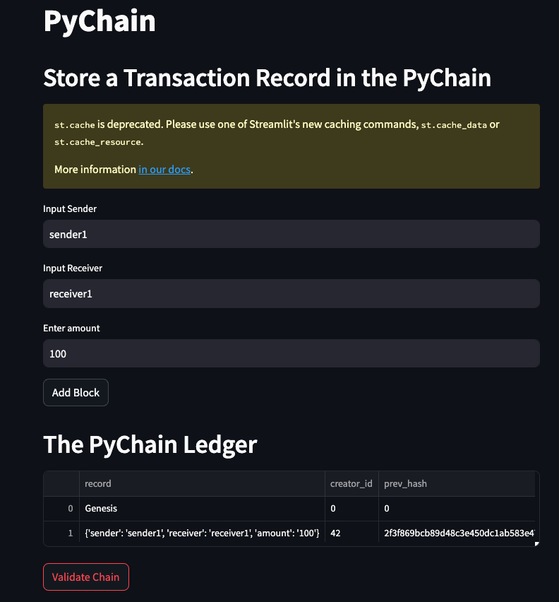
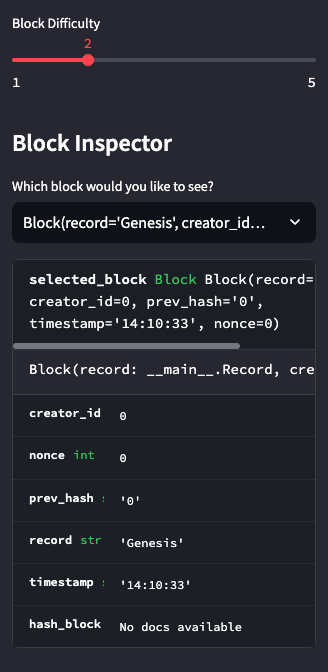

# blockchain_ledger
The program is a simple blockchain based application that records the ledger records of amount of funds being sent, sender, adn reciever. It uses a front-end platform to interaction with the user to enter the transaction data. Then it creates a hash number to the transaction, and also validates the transaction by verifying its previous hash number. Thus, it helps create a block chain database named 'The PyChain Ledger'.

---
## Technology
Following technologies are used in creating this application
- Python
- Pandas
- Streamlit

---
## Installation Guide

The user of the application will have to download Python,   Python package manager PIP and Git.

   - [How to install Python](https://www.python.org/downloads/) 
   - [How to install PIP ](https://pip.pypa.io/en/stable/installation/) 
   - [How to install Git ](https://git-scm.com/book/en/v2/Getting-Started-Installing-Git) 

---
## Usage

To use the application, follow the steps below.

1. Download the files from Github
    > mkdir blockchain_ledger  
    > git clone https://github.com/devops4cloud/blockchain_ledger  
    > cd blockchain_ledger
   
2. Excute the following line on the terminal
    > streamlit run pychain.py

---

## Interface

Main Application Interface  
     

Block Difficulty Slider  
     

---

## Contributors

This application is Mario G.
